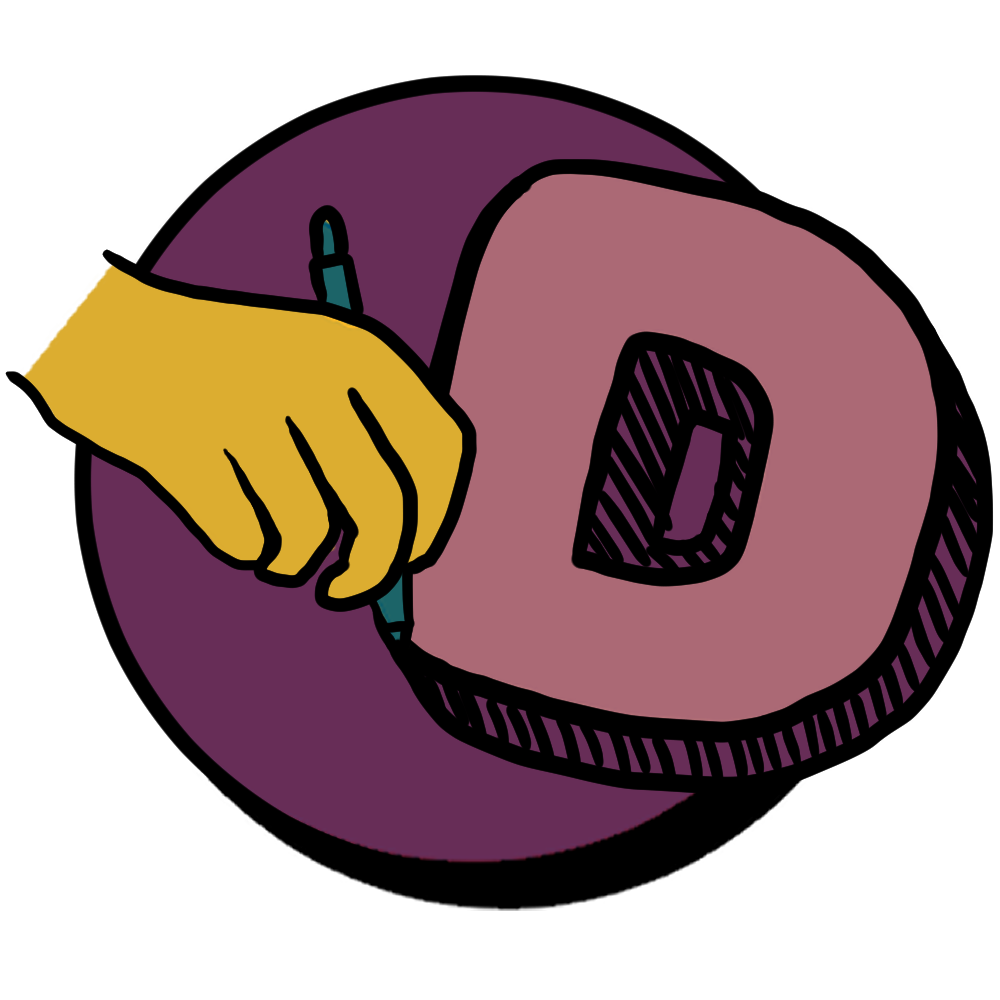
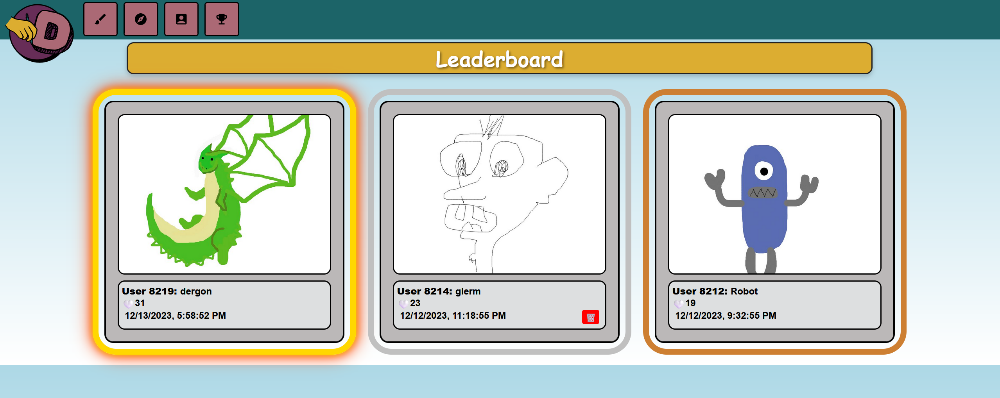
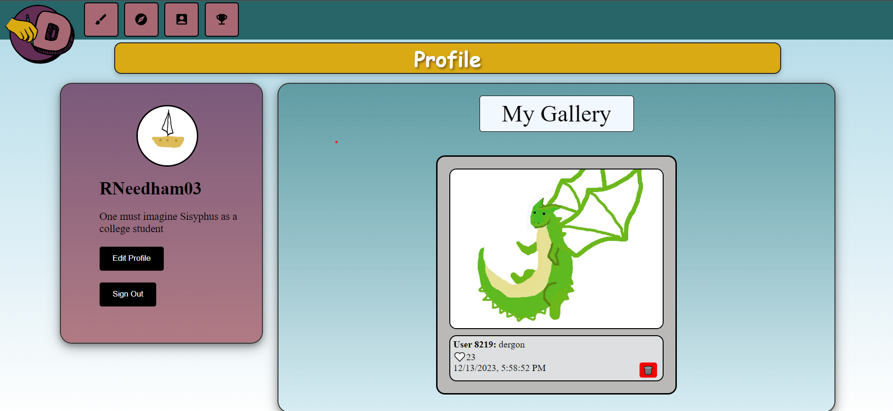
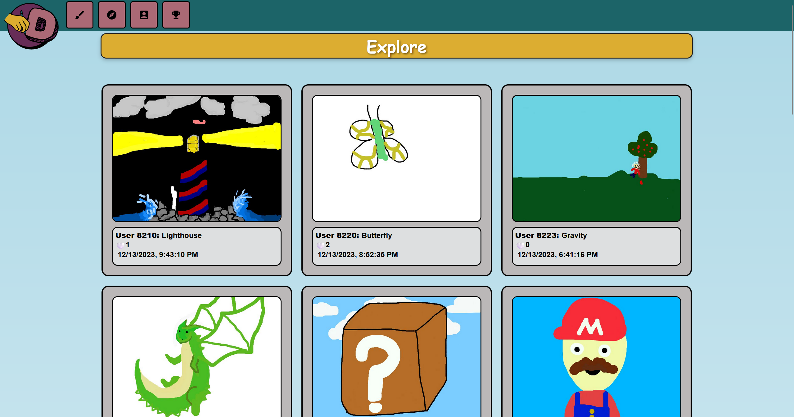

# DailyDoodles

### DailyDoodles is a drawing-based social media app where users are given drawing prompts to doodle and share with other users!

Draw pictures in a full range of colors, add a caption, and upload your image for the world to see!\
Then do this every day! Most liked doodles of the day are displayed on our leaderbord!

### Visit the site [here!](https://awsattempt.d3fwezq6icgsje.amplifyapp.com/) (🚧 Pardon our mess! Live site is currently under construction 🚧)

### Build Version:

Alpha version 0.2.14

## Screenshots:

### Logo



### Leaderboard



### Profile Page



### Explore Page



## Installation (Windows)

1. Install [Git](https://git-scm.com/downloads)
2. Install [Node.js](https://nodejs.org/en/download)
3. Clone the repository

   ```
   git clone git@github.com:WVU-CS230-2023-08-Group02/Daily-Doodles.git
   ```

4. From the root of the repo, navigate to the `api` folder and install backend dependencies:

   ```
   cd api
   npm i
   ```

5. From the root of the repo, navigate to the `react-doodles` folder and install frontend dependencies:

   ```
   cd react-doodles
   npm i
   ```

## Launching the App (localhost setup)

1. From the root of the repo, navigate to the 'api' folder and launch the backend

   ```
   npm start
   ```

2. From the root of the repo, navigate to the 'react-doodles' folder and launch the frontend

   ```
   npm run dev
   ```

3. Access the site at http://localhost:5173

## Technology Frameworks

- **Frontend:** [React](https://react.dev/), written in [TypeScript](https://www.typescriptlang.org/) (using the [Vite framework](https://vitejs.dev/))
- **Backend:** [Express](https://expressjs.com/), written in [JavaScript](https://www.javascript.com/)
- **Database:** [MySQL](https://www.mysql.com/)
- **Server and Database Hosting:** [AWS](https://aws.amazon.com/)

## Testing

- Unit testing completed with [Selenium](https://www.selenium.dev/)
- Security and code style testing completed with [SonarQube](https://www.sonarqube.org/)

## Future Improvements

- Friends system
- Minigame modes such as Speed Drawing and Pictionary
- More profile customization
- Sorting through posts by different metrics
- Tagging friends onto post
