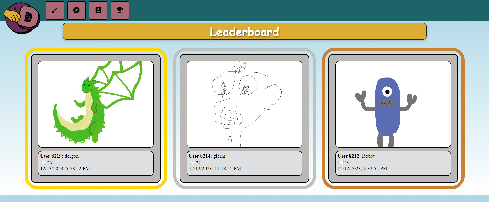
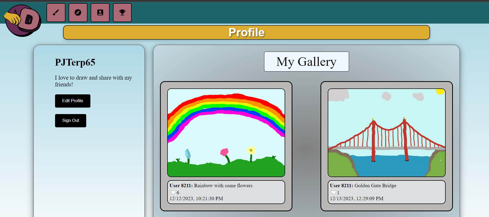

# DailyDoodles
### DailyDoodles is a drawing-based social media app where users are given daily prompts to doodle and share with other users!
Draw pictures in a full range of colors, add a caption, and upload your image for the world to see!\
Then do this every day! Most liked doodles of the day are displayed on our leaderbord!
### Visit the site here:
### Build Version:
Alpha version 0.2.14
## Screenshots:
### Logo

### Leaderboard

### Profile Page

## Installation
* Open a terminal in react-doodles and run: npm i
  * This should install all of the necessary frontend files
* Open a terminal in api and run: npm i
  * This should install all of the necessary backend files

## Framework
* React
* MySQL

## Testing
* Recursive testing completed with [Selenium](https://www.selenium.dev/)
* Security and code style testing completed with [SonarQube](https://www.sonarqube.org/)

## Future Improvements
* Saved friends list
* Minigame modes such as Speed Drawing and Pictionary
* More profile customization
* Sorting through posts by different metrics
* Tagging friends onto post

